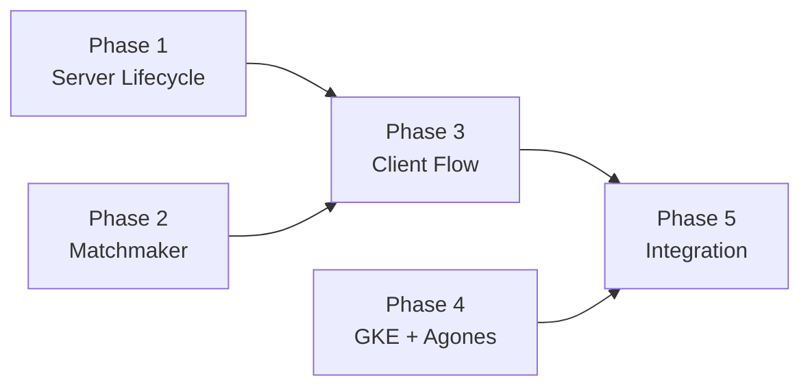

# Ironfront: Multiplayer Release Plan

## Directive

Convert the single infinite-loop arena server into a scalable, match-based multiplayer system backed by Agones on GKE Autopilot, with matchmaking in user-service. The end state: anyone who downloads the game can click Play, get matched into a server, and have a good experience — even if they're the only person online.

## Decisions

| Decision | Answer |
|----------|--------|
| Match duration | Fixed 5-minute timer |
| Fill policy | 15s countdown from first player join |
| Late joins | Allowed during ACTIVE |
| Bot backfill | None — matches run with whoever joins |
| Matchmaking | Simple FIFO queue, no skill/region matching |
| Results payload | Kills, deaths, damage dealt |
| Reconnect | None — disconnected player is removed |
| GKE mode | Autopilot (per-pod billing, managed nodes) |
| GKE region | europe-west1 (matches existing infra) |
| Matchmaker location | Inside user-service (Cloud Run), not a separate service |
| Agones allocation | user-service calls K8s Allocation API with GKE credentials |
| Lifecycle state tracking | All in Agones — DB only stores matchmaker queue (match tickets) |

## Architecture

Three traffic planes:
1. **HTTPS** — client ↔ user-service (auth, matchmaking, profile)
2. **K8s API** — user-service → Agones allocation
3. **UDP** — client ↔ game server (ENet gameplay, direct to pod IP via hostPort)

## Match Lifecycle (per GameServer pod)

```
BOOT → READY → FILLING → ACTIVE → ENDED → SHUTDOWN
```

- **BOOT** — Server starts, loads level, initializes systems.
- **READY** — Calls Agones `Ready()`. Now in the warm pool.
- **FILLING** — First player connects, 15s countdown starts. More players can join during countdown.
- **ACTIVE** — Match is live, 5-minute timer. Late joins allowed. Gameplay runs normally.
- **ENDED** — Timer expires. Broadcast results (kills, deaths, damage). Disconnect all peers after brief delay.
- **SHUTDOWN** — Calls Agones `Shutdown()`. Pod terminates. Fleet replaces it.

## Player Flow

```
Menu → "Play" → POST /play/find-match → poll GET /play/match-status/:id
  → MATCHED { host, port, match_token }
  → ENet connect to host:port, send JWT with allocation_id
  → play match (5 min)
  → receive results → scoreboard screen → "Play Again" re-queues
```

## Phases

### Phase 1 — Server Match Lifecycle

Rewrite the game server from infinite arena to one-match-then-exit. Fully testable locally without Agones.

**Scope:**
- Match state machine in `server_app.gd` (BOOT → READY → FILLING → ACTIVE → ENDED → SHUTDOWN)
- Stub `AgonesSDK` class (logs Ready/Health/Shutdown, no HTTP)
- Fill timer (15s countdown from first join, then transition to ACTIVE)
- Match timer (5 min countdown during ACTIVE)
- Match-end: broadcast results RPC, disconnect peers, exit process
- `arena_session_state.gd` gains match phase tracking
- `server_session_api.gd` gains match-end broadcast RPC
- Allocation ID verification on join (compare JWT claim vs server's ID; stub ID for local dev)

**Files:**
- `game/src/server/server_app.gd`
- `game/src/server/arena/arena_session_state.gd`
- `game/src/server/net/server_session_api.gd`
- New: `game/src/server/agones_sdk.gd` (stub)

**Test:** Run server locally, connect 1–2 clients. 15s fill countdown, 5 min match, results broadcast, server exits.

### Phase 2 — Matchmaker Endpoints

Add FIFO matchmaking to user-service. Stub allocator returns a fixed dev server address.

**Scope:**
- `match_tickets` table in DB schema (`ticket_id`, `account_id`, `status`, `server_host`, `server_port`, `allocation_id`, timestamps)
- `POST /play/find-match` — create ticket, return ticket ID
- `GET /play/match-status/:ticketId` — poll for status (QUEUED → MATCHED → EXPIRED)
- Matchmaker logic: on find-match, check for existing unfilled match or allocate new server; write address to ticket
- Stub allocator: returns a configured dev server address instead of calling Agones
- `POST /play/ticket` now includes real `server_allocation_id` in JWT

**Files:**
- `user-service/src/db/schema.ts`
- New: `user-service/src/api/play/find-match/POST.ts`
- New: `user-service/src/api/play/match-status/[ticketId]/GET.ts`
- New: `user-service/src/matchmaker/` (allocator logic)
- `user-service/src/api/play/ticket/POST.ts` (allocation ID in JWT)

**Test:** Call find-match, poll match-status, get back a dev server address. Ticket flow works end-to-end via curl/httpie.

### Phase 3 — Client Match Flow

Replace hardcoded server connection with matchmaker-driven flow.

**Scope:**
- Queue screen UI: "Finding match..." spinner + cancel button
- `POST /play/find-match` on "Play" button
- Poll loop on `GET /play/match-status/:ticketId`
- Connect to returned `host:port` with match token
- Post-match: results screen with scoreboard, "Play Again" button re-queues
- Remove hardcoded host/port from `arena_client.gd`

**Files:**
- `game/src/client/arena/arena_client.gd`
- `game/src/client/net/client_session_api.gd` (match-end result handler)
- UI scenes for queue screen + results screen

**Test:** Full loop: click Play → find match → connect → play → results → play again.

### Phase 4 — GKE + Agones Infrastructure

Stand up the platform. Game servers run for real on Agones.

**Scope:**
- GKE Autopilot cluster in Pulumi (`infra/`)
- Agones Helm chart install via Pulumi
- Fleet manifest (`fleet/`): game server container spec, UDP port, resource requests, buffer replicas
- Fleet autoscaler: buffer-based, keep 1 ready server warm
- Firewall rule: allow inbound UDP on Agones port range
- IAM: Cloud Run SA gets `container.developer` on GKE cluster (for Allocation API)
- Game server Dockerfile + CI pipeline (Artifact Registry, mirrors user-service pattern)

**Files:**
- New: `infra/src/gke.ts` (cluster + Agones)
- New: `fleet/fleet.yaml` (Agones Fleet manifest)
- New: `fleet/autoscaler.yaml`
- New: `game/Dockerfile.server` (headless Godot export)
- `infra/src/index.ts` (export cluster info)
- `infra/src/config.ts` (game server image tag)

**Test:** `pulumi up` creates cluster. Fleet shows 1 Ready GameServer. Manual allocation via kubectl works.

### Phase 5 — Wire It All Together

Swap stubs for real integrations. Production deployment.

**Scope:**
- `AgonesSDK` stub → real HTTP calls to Agones sidecar (`localhost:${AGONES_SDK_HTTP_PORT}`)
- Matchmaker stub allocator → real Agones Allocation API (K8s client from user-service)
- Health ping timer (every 5s) during FILLING and ACTIVE
- Game server reads allocation ID from Agones GameServer metadata
- End-to-end production test: deploy fleet, matchmake, play, match ends, pod replaced

**Files:**
- `game/src/server/agones_sdk.gd` (real HTTP)
- `user-service/src/matchmaker/` (real K8s allocation client)
- Config/env wiring for Agones SDK port, cluster credentials

**Test:** Full production loop with real Agones. Multiple matches in sequence. Fleet autoscaler replaces consumed servers.

## Dependency Graph



Phases 1, 2, and 4 are independent. Phase 3 needs 1+2. Phase 5 needs 3+4.
